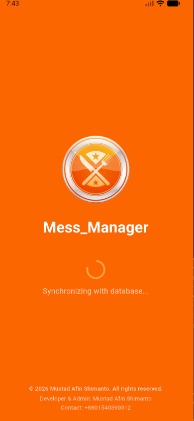
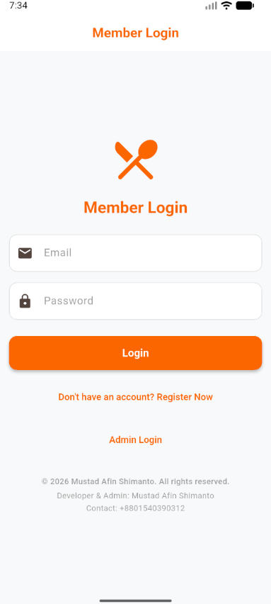

# 🍽️ MessBook — Mess & Meal Management System

[](https://flutter.dev)
[](https://firebase.google.com)
[](https://dart.dev)
[](https://github.com/Md-Kawsarul-Islam/MessBook)
[](https://opensource.org/licenses/MIT)

**MessBook** is a Flutter-based mess and meal management application designed for students and people living in shared accommodations such as messes, hostels, and dormitories.

The application brings meal tracking, market expenses, member contributions, market duties, requests, notices, communication, analytics, and financial reporting into a single platform.

Instead of relying on notebooks, spreadsheets, or multiple external applications, MessBook provides a centralized system for managing day-to-day mess operations.

---

## 🤖 AI-Assisted Development

This project was developed with the assistance of AI-powered coding and development tools.

AI was used throughout the development process for architecture assistance, implementation, debugging, documentation, and development workflow support.

---

## 📸 Screenshots

<p align="center">
  
</p>

<p align="center">
  
  &nbsp;&nbsp;&nbsp;&nbsp;
  
</p>

---

# 🌟 Why MessBook?

Managing a shared mess manually can become complicated when multiple members are involved.

MessBook focuses on:

* 🍽️ **Meal Management** — Track breakfast, lunch, and dinner.
* 💰 **Expense Management** — Record market expenses and member contributions.
* 📊 **Financial Transparency** — Monitor balances, expenses, and meal rates.
* 🛒 **Market Duty Management** — Organize and track member duties.
* 📢 **Mess Communication** — Publish notices and communicate with members.
* 📄 **Reporting** — Generate financial reports and statements.
* 🔐 **Role-Based Access** — Separate Admin, Manager, and Member capabilities.
* ☁️ **Cloud Data** — Store and synchronize application data using Firebase.

---

# 🔥 Key Features

## 👑 Admin

The Admin has global control over mess and user management.

### User & Role Management

* Manage users and their roles.
* Assign Managers.
* Reset member passwords.
* Control access to different areas of the application.

### Mess Management

* Manage multiple mess/hostel environments.
* Generate hostel invite codes.
* Manage mess-related data.

### Data Management

* Export database backups.
* Maintain centralized application data.

---

## 💼 Manager

The Manager handles the day-to-day operations of a mess.

### 💰 Financial Management

* Record daily market expenses.
* Record member contributions.
* Manage hand-cash transactions.
* Review expense requests.

### 🍽️ Meal Management

* Record breakfast, lunch, and dinner.
* Track member meal consumption.
* Monitor meal-related statistics.

### 🛒 Market Duty

* Assign market duties.
* Track duty schedules.
* Allow members to view their assigned duties.

### 📢 Notices

* Publish important notices.
* Communicate operational updates to members.

### 📝 Request Processing

* Review member expense/item requests.
* Approve or reject submitted requests.

---

## 👤 Member

Members can monitor their personal mess activities through their dashboard.

### 📊 Personal Dashboard

* View current balance.
* View total meal count.
* View current meal rate.
* Monitor personal mess information.

### 📜 History

* View meal history.
* View contribution history.
* View expense-related information.

### ⭐ Meal Feedback

* Rate daily meals.
* Provide feedback to the Manager.

### 🛍️ Entry Requests

* Request money/items for specific purchases.
* Track submitted requests.

### 🔔 Notifications

* Receive updates about notices.
* Receive request approval information.
* Stay informed about market duties.

---

# 🚀 Specialized Modules

## 📊 Dynamic Analytics

Interactive charts powered by `fl_chart` provide visual insights into:

* Expense trends
* Meal consumption
* Financial information
* Mess activity

## 💬 Real-Time Group Chat

Members can communicate with each other through an integrated group chat instead of depending on external messaging applications for everyday mess-related communication.

## 🛒 Smart Market Duty

Market duties can be assigned and tracked through the application, helping distribute responsibilities among members.

## 🧠 Expense Prediction

MessBook includes an expense prediction module designed to estimate future monthly costs based on current spending patterns.

## 📄 PDF Reporting

Generate professional financial documents and monthly statements for easier auditing and record keeping.

---

# 🛠️ Technology Stack

| Component        | Technology                  | Purpose                                    |
| ---------------- | --------------------------- | ------------------------------------------ |
| Frontend         | **Flutter**                 | Cross-platform application development     |
| Language         | **Dart**                    | Application logic and UI development       |
| Database         | **Cloud Firestore**         | Cloud-based real-time NoSQL database       |
| Authentication   | **Firebase Authentication** | User authentication                        |
| State Management | **Provider**                | Application state management               |
| Device Security  | **safe_device**             | Root/jailbreak and device integrity checks |
| Password/Hashing | **BCrypt**                  | Password hashing / data integrity          |
| Charts           | **fl_chart**                | Data visualization                         |
| Reporting        | **PDF generation**          | Financial reports and statements           |

---

# 🔒 Security

MessBook includes several security-focused features:

### 🔐 Authentication

User authentication is handled through Firebase Authentication.

### 📱 Device Integrity

The application can check whether a device environment is compromised, such as rooted or jailbroken devices.

### 🛡️ Input Validation

Financial and application inputs are validated before processing to reduce invalid or unexpected data.

### 🔑 Password Protection

BCrypt is used where password hashing is required.

### 📦 Release Obfuscation

Release builds can use Dart obfuscation and Android optimization/minification to make application reverse engineering more difficult.

> Security mechanisms reduce risk but cannot guarantee that an application is impossible to reverse engineer or compromise.

---

# 📂 Project Structure

```text
lib/
├── models/         # Firestore data models and serialization
├── providers/      # ChangeNotifier state management
├── screens/        # Admin, Manager, Member, Auth and Shared screens
├── services/       # Authentication, notifications, prediction, etc.
├── widgets/        # Reusable UI components
├── utils/          # Constants, formatters and helper functions
├── routes.dart     # Centralized application routes
└── main.dart       # Application entry point
```

---

# ⚙️ Getting Started

## 1️⃣ Prerequisites

Make sure you have:

* Flutter SDK `3.7.2` or later
* Dart SDK
* Firebase project
* Firebase CLI
* FlutterFire CLI

Install Firebase CLI:

```bash
npm install -g firebase-tools
```

Install FlutterFire CLI:

```bash
dart pub global activate flutterfire_cli
```

---

## 2️⃣ Clone the Repository

```bash
git clone https://github.com/Md-Kawsarul-Islam/MessBook.git
cd MessBook
```

---

## 3️⃣ Install Dependencies

```bash
flutter pub get
```

---

## 4️⃣ Configure Firebase

Create your Firebase project and enable the required services.

Then configure Firebase for the Flutter application:

```bash
flutterfire configure
```

Depending on your configuration, you may need to enable:

* Firebase Authentication
* Cloud Firestore
* Firebase Cloud Messaging

---

## 5️⃣ Run the Application

### Android

```bash
flutter run
```

### Web

```bash
flutter run -d chrome --web-port=3000
```

---

# 📦 Production Build

For an Android release build:

```bash
flutter build apk --release
```

If the project is configured with the included release script:

```powershell
.\build_release.bat
```

The release configuration can include Dart obfuscation and Android build optimization.

---

# 🧪 Testing

Run Flutter tests with:

```bash
flutter test
```

Analyze the project:

```bash
flutter analyze
```

---

# 🤝 Contributing

Contributions and suggestions are welcome.

You can contribute by:

* 🐞 Reporting bugs
* 💡 Suggesting new features
* 🔧 Improving existing functionality
* 📝 Improving documentation
* 🚀 Submitting pull requests

---

# 👨‍💻 Project Maintainer

**Md Kawsarul Islam**

CSE Student | Full Stack Developer | Flutter Developer

GitHub: [Md-Kawsarul-Islam](https://github.com/Md-Kawsarul-Islam)

---

# 📄 License

This project is licensed under the **MIT License**.

---

© 2026 Md Kawsarul Islam
